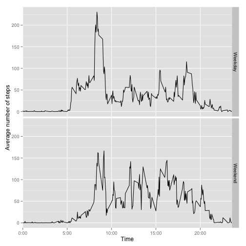

# Reproducible Research: Peer Assessment 1

## Loading and preprocessing the data

Loading data from CSV, also converting intervals to factors:


```r
unzip('activity.zip')
activ_monit_data <- read.csv('activity.csv')
activ_monit_data$interval <- as.factor(activ_monit_data$interval)
```

## Mean total number of steps taken per day

First calculating sum of steps per day


```r
steps_per_day <- tapply(activ_monit_data$steps, activ_monit_data$date, sum, na.rm = T)
hist(steps_per_day)
```

 

Then calculating mean number of steps per day, considering days with NA steps value as no steps:


```r
mean(steps_per_day)
```

```
## [1] 9354
```

The same calculation but this time ignoring days with NA steps (having sum of steps equals zero):


```r
mean(steps_per_day[steps_per_day > 0])
```

```
## [1] 10766
```

Now calculating median:


```r
median(steps_per_day)
```

```
## [1] 10395
```

Ignoring days with NA steps:


```r
median(steps_per_day[steps_per_day > 0])
```

```
## [1] 10765
```

## Average daily activity pattern

Average number of steps for each 5-minute interval:


```r
daily_activity = tapply(activ_monit_data$steps, activ_monit_data$interval, mean, na.rm = T)

plot(x=names(daily_activity), 
     y=daily_activity, 
     type="l", 
     xlab="Time", 
     ylab="Number of steps", 
     xaxt="n")
axis(1, labels=c('0:00', '5:00', '10:00', '15:00', '20:00'), at=c(0, 500, 1000, 1500, 2000))
```

 

Let's find out which 5-minute interval is the most activ:


```r
max_val = daily_activity[daily_activity == max(daily_activity)]
interval = names(max_val)[[1]]
```

Interval of maximum value is ``835``. Interval, corresponding to ``835`` is 8:35 - 8:40 am. So this is the most active 5-minute in day on average. Probably it's the time when a person is either going to work or on morning jogging.

## Imputing missing values

Total number of missing values in dataset:


```r
res = sum(is.na(activ_monit_data$steps))
res
```

```
## [1] 2304
```

Ratio from total number of observations:


```r
res / dim(activ_monit_data)[[1]]
```

```
## [1] 0.1311
```

We need to devise a strategy to fill in this values. One possible solution is to fill with mean/median value in given day. Before doing so let's check what is the ratio of NA values across days:


```r
temp = tapply(is.na(activ_monit_data$steps), activ_monit_data$date, function (x) {sum(x) / length(x) })
plot(temp, type="l")
```

 

From plot we can see that all NA values are grouped in few days, and these days does not have any other values except NA. So the strategy to take mean/median from a day will not work as mean or median for these days is 0 (or NA). 

As NA values are evenly divided across intervals we can use interval mean or median to fill in NA values. Now we need to find out what's best to use here - mean or median. Let's calculate median number of steps per 5-minute interval:


```r
median_per_interval = tapply(activ_monit_data$steps, activ_monit_data$interval, median, na.rm=T)
length(median_per_interval[median_per_interval > 0])
```

```
## [1] 53
```

Looks like the data highly scewed, so most of the medians is 0. Seems like mean suits better our needs. We'll create new dataset which will have NA values replaced with mean number of steps for given interval across all days.


```r
activ_monit_data_no_na <- activ_monit_data
mean_per_interval = tapply(activ_monit_data$steps, activ_monit_data$interval, mean, na.rm=T)
activ_monit_data_no_na$steps[is.na(activ_monit_data_no_na$steps)] <- mean_per_interval[activ_monit_data_no_na$interval[is.na(activ_monit_data_no_na$steps)]]
```

Total number of steps per day for new dataset:


```r
steps_per_day <- tapply(activ_monit_data_no_na$steps, activ_monit_data_no_na$date, sum, na.rm = T)
hist(steps_per_day)
```

 

Mean:


```r
mean(steps_per_day)
```

```
## [1] 10766
```

Median:


```r
median(steps_per_day)
```

```
## [1] 10766
```

Looking at the histogramm we can see that total number of steps per day in new dataset ressembles normal distribution better than in old dataset. Also considering that mean and median are the same value we can say that it is very likely that number of steps per day can be described by normal distribution.

## Differences in activity patterns between weekdays and weekends

Adding new variable in new dataset:


```r
activ_monit_data_no_na$weekend <- as.factor(weekdays(as.Date(activ_monit_data_no_na$date)) %in% c("Saturday", "Sunday"))
```

Calculating daily activity for weekdays and weekends and creating plots:


```r
daily_activity <- with(activ_monit_data_no_na, tapply(steps, list(interval, weekend), mean, na.rm = T))
daily_activity <- as.data.frame(daily_activity)
new_daily_activity <- data.frame(interval=row.names(daily_activity), value=daily_activity[,"FALSE"], weekend="Weekday")
new_daily_activity <- rbind(new_daily_activity, data.frame(interval=row.names(daily_activity), value=daily_activity[,"TRUE"], weekend="Weekend"))
daily_activity <- new_daily_activity
daily_activity$interval <- as.integer(as.character(daily_activity$interval))

library(ggplot2)
ggplot(daily_activity, aes(interval, value)) + facet_grid(weekend ~ .) + geom_line(aes(group=weekend)) + scale_x_discrete(breaks=c(0, 500, 1000, 1500, 2000), labels=c('0:00', '5:00', '10:00', '15:00', '20:00')) + xlab("Time") + ylab("Average number of steps") 
```

 

Looking at the plot we see similar peak in about 8:00-8:30 am, but in overall weekend have more uniformly distributed average number of steps, which means that physical activity is divided more evenly across the day on weekend than on weekdays.
